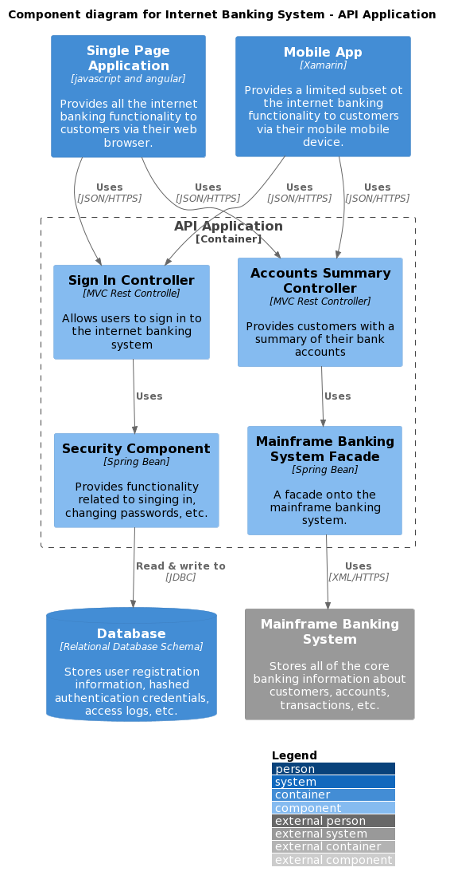
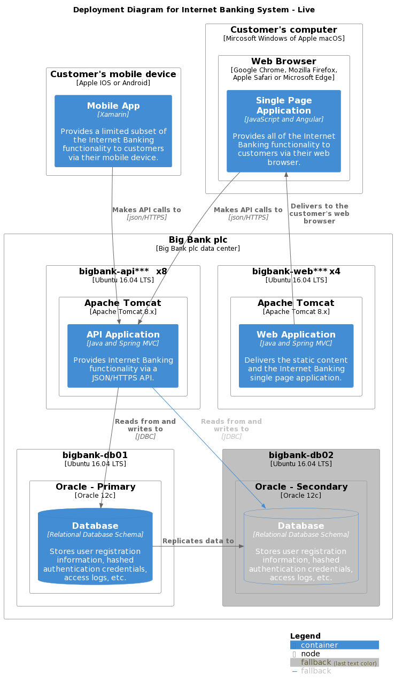

# Project Name
提供对项目和文档本身的总体的、扼要的说明

## Catalogue
- [Introduction](#Introduction)
- [Getting Started](#Getting-Started)
  - [Prerequisite](#Prerequisite)
  - [Configuration and Usage](#Configuration)
  - [Dependencies](#Dependencies)
- [Advanced](#Advanced)
  - [Technical Architecture](#Technical-Architecture)
  - [Project Directories](#Project-Directories)
  - [Module Description](#Module-Description)
  - [Upstream and Downstream Services](#Upstream-and-Downstream-Services)
- [Version History](#Version-History)
- [Appendix](#Appendix)
  - [Glossary](#Glossary)
  - [Recipes](#Recipes)

## Introduction
结合场景深入对项目的系统功能，业务价值进行描述。可以包含产品演进路线以及当前已实现能力的说明，等。


## Getting Started
又称“使用篇”，提供初级的使用教程

### Prerequisite
开发、编译或运行该项目的必要前置条件说明，需要包含以下内容
* 是否存在底层操作系统的限制？如有，请加以说明。对于支持不同操作系统的，请分系统版本对必要对依赖等进行说明。
* 是否需要特定的IDE的支持
* 以Java为例，依赖项包括不限于JDK版本，构建工具（Maven或Gradle）版本，项目依赖框架以及版本，三方依赖jar（如厂商提供的特定类库），需要的中间件等
* 其他编程语言类似


### Configuration and Usage
对如何本地配置或启动项目的说明
* 编译、启动项目命令说明
* 对于项目启动项目需要的命令，参数请详细说明（如对Jvm参数有特殊需求，项目启动profile内占位符等）
```
code blocks for commands
```

### Dependencies

## Advanced
提供进阶的说明，帮助读者更深入的了解项目

### Technical Architecture
此处提供的架构资料，帮助读者在深入阅读代码之前就对系统有宏观的理解。便于有针对的去了解项目。架构材料内容必须随着交付的持续进行而及时更新，确保与代码实现保持一致。

架构资料默认推荐[C4 Model](https://c4model.com/)的形式。推荐补充 component 以及 deployment 两个维度的视图，具体见下方示例。

#### Component diagram sample


#### Deployment diagram sample


对于遗留项目，也可以使用传统的“4A架构”（采用其中的应用架构、技术架构、数据架构）或者“4+1视图”（场景视图、逻辑视图、物理视图、处理流程视图）

### Project Directories
项目结构、目录的说明，面向团队新人介绍代码分包约定。

```
filetree 
├── ARCHITECTURE.md
├── LICENSE.txt
├── README.md
├── /account/
├── /bbs/
├── /docs/
│  ├── /rules/
│  │  ├── backend.txt
│  │  └── frontend.txt
├── manage.py
├── /oa/
├── /static/
├── /templates/
├── useless.md
└── /util/

```
### Module Description
对于复杂项目，建议结合上一条的项目目录说明，分模块对不同的模块具备的功能， 彼此依赖进行说明

### Upstream and Downstream Services
此处是对系统的上下游依赖服务的说明。可以以表格形式列举出上游能力消费方以及下游的能力提供者。

## Version History
系统的版本演进记录，可以以链接的形式关联发布历史的在线文档或者其他独立离线文档
[Release Notes](README-v4.md)

* v1.1.0
   * Various bug fixes and optimizations
   * See [commit change]() or See [release history]()
* v1.0
   * Initial Release

## Appendix
附录，对主文档关键信息的补充和说明

### Glossary
文档涉及的术语，缩写等词汇统一说明

### Recipes
最佳实践，参考的链接，例如:

- [六边形架构](https://alistair.cockburn.us/hexagonal-architecture/)
- [Google Java代码规范](README-v4.md)
- [C4 Model](https://c4model.com/)


